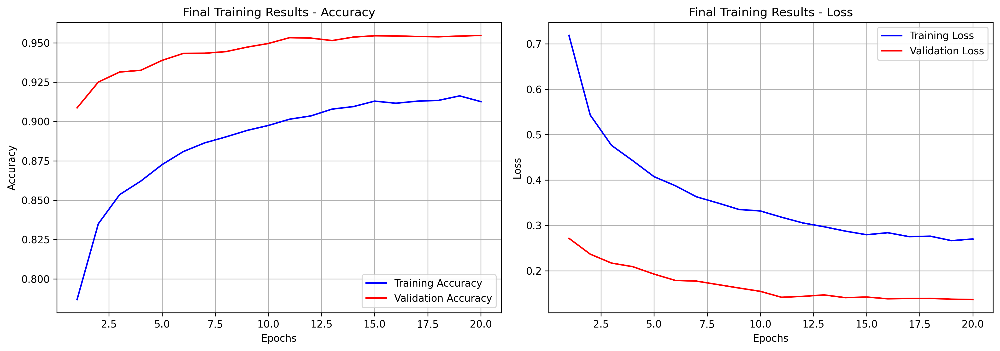
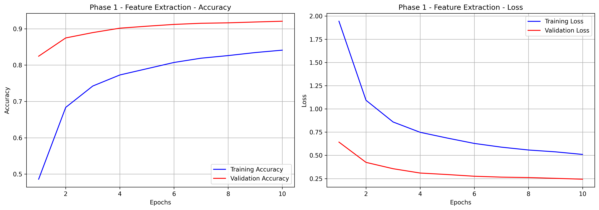

 # 🌱 Plant Disease Classifier

A Deep Learning model to detect **39 different plant diseases** using **MobileNetV2** transfer learning.



## 📊 Results

- **Final Validation Accuracy**: ~95.8%
- **Final Validation Loss**: ~0.12

### Training Visualizations

**Phase 1 - Feature Extraction**


**Phase 2 - Fine Tuning**


## 🛠 Technologies Used
- TensorFlow / Keras
- MobileNetV2 (alpha=0.75)
- Data Augmentation
- Mixed Precision Training

## 🚀 How to Use

```python
from inference import PlantDiseasePredictor

predictor = PlantDiseasePredictor()
result = predictor.predict("test_leaf.jpg")

print(result)
```
