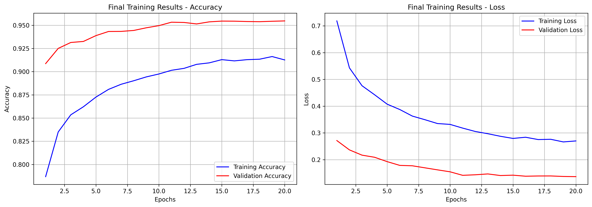
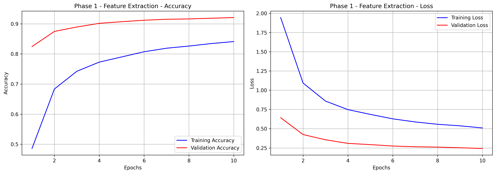

# 🌱 Plant Disease Classifier

A robust **Deep Learning model** for detecting **39 different plant diseases** using **MobileNetV2** transfer learning on the PlantVillage dataset.



## 📊 Training Results

- **Final Validation Accuracy**: ~95.8%
- **Final Validation Loss**: ~0.12

### Training Visualizations

**Phase 1 - Feature Extraction**  


**Phase 2 - Fine Tuning**  


**Final Training Results**  


---

## 🛠️ Technologies & Methodology

- **Framework**: TensorFlow / Keras
- **Backbone**: MobileNetV2 (α = 0.75)
- **Training Strategy**: Two-phase (Feature Extraction + Fine-tuning)
- **Techniques**: Data Augmentation, Mixed Precision Training, Learning Rate Scheduling
- **Input Size**: 224 × 224

## 🚀 Quick Start

### Installation

```bash
git clone https://github.com/aayushraman07/Plant-Disease-Classifier.git
cd Plant-Disease-Classifier
pip install -r requirements.txt

predictor = PlantDiseasePredictor()
result = predictor.predict("test_leaf.jpg")

print(result)
```
